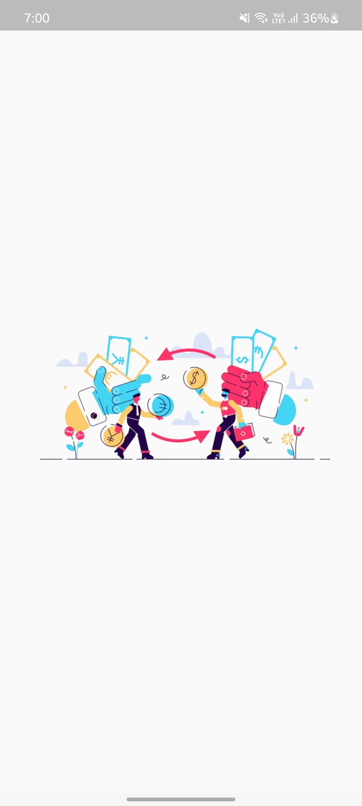
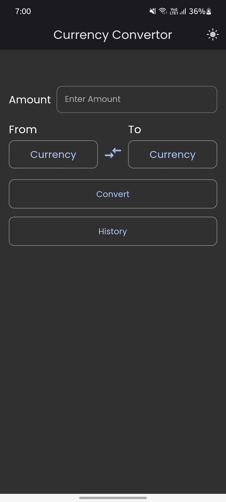
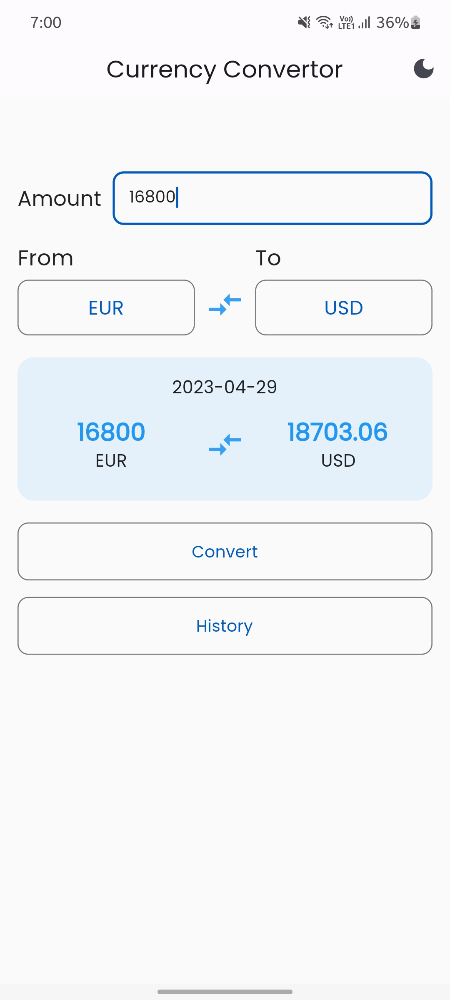
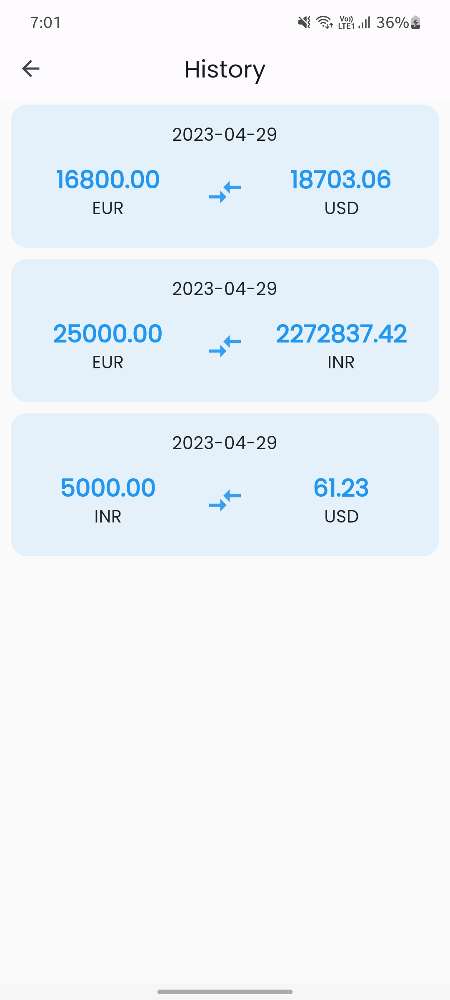

# **Currency Convertor App**
In This app user can search any currency and convert to another any currency easily.

---

## ⚙️ Features

- Main features are as follows:
    - Convert Amount in any Currency
    - Show thw history from Database
    - Light & Dark Theme
    - Search Currency functionality

## 📲 Screenshots

  

## 📽️ GIF

 <br

 
---
### You can show some respect by starring 🌟 the repository!
---

